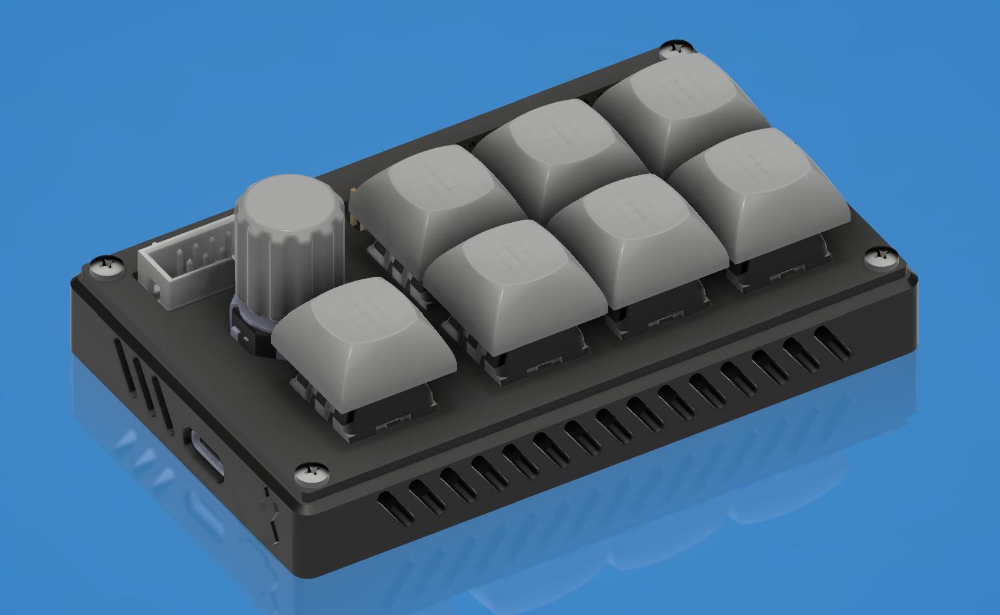

<p align="center">

</p>  

# Mactra RX231搭載 エンコーダ付き7キーマクロパッド/開発ボード
Mactra はRenesas製RX231マイコンを搭載した、7キーマクロパッド 兼 開発ボードです。  
キーマップ変更は[こちらのサイト](https://random-eel.github.io/mactra-configurator/index.html)へ (要WebHID対応)  
  
## 仕様・機能
 - Renesas製 RX231 マイクロコントローラ搭載 (R5F52315ADFL 48ピンQFP)
    - 32MHz 動作 (16MHz 外部発振器付き)
    - USB-C接続 (ファンクションのみ)
    - USBバスパワー動作専用
 - Kailh製MX互換スイッチホットスワップソケット x 7
   - ホットスワップなので好きな互換スイッチに入れ替え可能
   - RGB LEDバックライト付き (SK6812Mini-E Bit-bang制御)
   - 1 + 2行x3列 での接続
   - 2x3+ロータリーエンコーダ部分にダイオード有 (Col->Row)
 - RKJXT1F 4方向スイッチ付きロータリーエンコーダ x 1
 - 動作確認用オンボードLED x 2
 - GPIO/GND ピンソケット
 - 3.3v/5v ピンヘッダ
 - E2 エミュレータ用コネクタ

> [!WARNING]
> ### ⚠️ Rev.1はファームウェア書き込み時に特定のピンをショートさせる必要があります。ご注意下さい。
> Rev.2 も必要ですが、デバッグポート側にスイッチが存在し、ケーブル等で接続する必要はありません。

> [!CAUTION]
> ### ☠️ Rev.1はロータリーエンコーダの配線に致命的なミスがあり使用できません。  
> <b><u>メインボードだけRev.2の場合があります。</u></b>上記のスイッチで見分けてください。  

※現在ファームウェア開発中 開発状況を以下に示します。   
|開発状況|内容|説明|
|:---:|:---:|---:|
|✅️|Lチカ|背面LED点滅|
|✅️|[GPIOチェックファームの作製](https://github.com/random-eel/mactra-rx231/blob/main/firmwares/RX231-Mactra-GPIO-Test.mot)|ハンダ付けテスト用|
|✅️|[マトリクステスト](https://github.com/random-eel/mactra-rx231/blob/main/firmwares/RX231-Mactra-Matrix-Test.mot)|全キーのスキャン|
|✅️|ロータリーエンコーダ回転対応|左右回転方向等の取得|
|✅️|エンコーダ4方向スイッチ対応|上下左右のスイッチ|
|✅️|USBファンクション動作|USBデバイスとして認識|
|✅️|キーボード動作|マクロキーとして使用可能に|
|✅️|[RGB LED動作](https://github.com/random-eel/mactra-rx231/blob/main/firmwares/RX231-Mactra-SK6812Mini-E-Test.mot)|SK6812Mini-Eの点灯|
|✅️|RGB LED設定対応|キー同時押し等で変更|
|✅️|キーの設定変更対応|(ストレッチゴール)|  

## 使用方法
Mactra本体とホストデバイスをUSB-Cケーブルで接続します。  
背面のディップスイッチを操作する必要がある場合は、**必ずケーブルを抜いてから**操作して下さい。

### マクロキーとして使用する場合
**電源を切った状態**で、背面ディップスイッチを BOOT MODE: Off; USB BOOT: Off; に設定後、ケーブルを接続します。  
ファームウェアが書き込まれている場合、ケーブル接続後にマクロパッドとして動作します。  
書き込まれていない場合、下記の ***開発ボードとして使用する場合*** を参考に、ファームウェアを書き込んでください。  

初期設定のキーマップは以下の通りです。
```
(左右でボリューム)
    輝度アップ
前曲 再生/停止 次曲   [F22] [F23] [F24] 
    輝度ダウン

    [ミュート]      [Pause] [Alt+PrSc] [PrSc]
```

RGB LEDの点灯パターン・色変更等は、操作仕様が未確定なので未実装です。  
キーマップの変更は、現状ソースコードからのビルドのみとなり、未対応です。  
マルチプルエンドポイントを使用したシリアル通信で変更可能になる予定です。  

### 開発ボードとして使用する場合
<details>  
<summary>詳細</summary>  
   
基板上で<u>GPIOへのプルアップ抵抗の接続はありません</u>。  
内蔵プルアップ抵抗を利用して下さい。  
また、開発ボードとしてGPIOを使用する際には、基板上で接続されているピンも含まれているので、使用時には注意が必要です。  
基板上に接続があるピンは下記の通りです。  

|ピン|機能|説明|
|:---|---|---:|
|P14|LED|動作確認(Lチカ)用　背面|
|P16|VCC|(ブートローダモード指定用)****|
|P26|TXD|(E2デバッガ用送信)*|
|P27|RGB|RGB LED 通信用**|
|P30|RXD|(E2デバッガ用受信)*|
|P31|SW1|左下スイッチ ダイオード無し***|
|P42|RCW|ロータリーエンコーダ用 時計回り|
|P46|RCCW|ロータリーエンコーダ用 反時計回り|
|PA1|COL4|スイッチ用マトリクス 縦4|
|PA3|COL3|スイッチ用マトリクス 縦3|
|PA4|COL2|スイッチ用マトリクス 縦2|
|PA6|COL1|スイッチ用マトリクス 縦1|
|PE1|ROW3|スイッチ用マトリクス 横3|
|PE2|ROW2|スイッチ用マトリクス 横2|
|PE3|ROW1|スイッチ用マトリクス 横1|
|PE4|COL5|スイッチ用マトリクス 縦5|

\* シングルチップモード/FINED接続で使用する場合、自由に使うことが出来ます。  
** BSS138が接続されています。 常にRGB LEDに信号が流れるので、注意が必要です。  
*** スイッチはグラウンドと接続されています。  
**** USB経由でのファームウェア書き込み時に必要です。  

#### プログラムをUSB経由で書き込んで使う場合

> ##### ⚠️ Rev.1の場合
> スイッチを設定しても、ブートローダーモードへ起動せず、ファームウェアが書き込めません。  
> GPIO P16ピン と 3V3 ピンを接続してください。
> ##### ⚠️ Rev.2の場合
> 側面に P16-3V3 を接続するスイッチがあります。
> USB側にスライドするとOFFです。
 
<details>
<summary>詳細</summary>
 
1. **ケーブルを抜いた状態**で、背面ディップスイッチを BOOT MODE: On; USB BOOT: On; に設定後、ケーブルを接続します。  
2. Renesas Flash Programmer を使用して、ビルドしたプログラムを指定し、書き込みます。  
3. **ケーブルを抜き**、背面ディップスイッチを BOOT MODE: Off; USB BOOT: Off; に設定後、ケーブルを再接続します。
</details>

#### E2 エミュレータを使う場合(オンチップデバッギング)
<details>
<summary>詳細</summary>
 
1. **電源を切った状態**で、背面ディップスイッチを BOOT MODE: On; USB BOOT: **Off**; に設定します。
2. CS+/e2studio で E2エミュレータの設定をし、接続します。 (電源供給可)
3. プログラムを実行します。  
※ E2エミュレータから電源を供給すると、5V端子の出力は無効化されます。
</details>

</details>  

## ケースについて
casesフォルダに3Dプリンタで出力可能なモデルを用意してあります。  
以下のネジが必要になります。  
 - 3Dプリントしたケースの場合 (Type 1: Enclosed/Slotted Enclosed)
   - M2 15mmネジ x 4
   - M2用インサートナット x 4
 - 3Dプリントしたケースの場合 (Type 2: Slotted)
    - M2 12mmネジ x 4
    - M2 ナット x 4
 - ケース無しで使う場合 (GPIO使用時には注意)
    - M2 5mmネジ x 8
    - M2 10mm スタンドオフ x4
## ソースコードについて (TBD)
Renesas製のサンプルコード及びFITモジュールを使用しているため、公開可能かどうか不明です。(調べる予定です…)  
> [!WARNING]
> #### ⚠️ AI生成コードについて
> このキーボードのファームウェア開発にはGeminiを使用したコードが含まれています。ご了承下さい。  
> 自作/生成したコードのみで動作するファームウェアが完成した場合、確認後にすべてのソースコードを公開する予定です。  

## 免責事項
このファームウェア・製品を使用していて、誤字が増えた、ホストデバイスが壊れた、核戦争が起きた、デバイスが正しく動作しなかったせいで会社をクビになった等があっても、設計/製作者は一切の責任を負いません。  

## 使用したアプリ・参考にしたサイト・サンプルコード等
* KiCAD 9.0.6
* Fusion 360
* [Keyboard Layout Editor](https://www.keyboard-layout-editor.com/)
* [ai03 Plate Generator](https://kbplate.ai03.com/)
* [秋月電子 RX621マイコンボード 参考資料(回路図)](https://akizukidenshi.com/catalog/g/g105763/)
* [RSK-RX231 RX231 CPU Board Schematics](https://www.renesas.com/ja/design-resources/boards-kits/rsk-rx231)  
* [RX230, RX231 ハンドブック](https://www.renesas.com/ja/products/rx231)
* [RX230グループ、RX231グループ　ユーザーズマニュアル　ハードウェア編](https://www.renesas.com/ja/products/rx231)
* [RXファミリ ハードウェアデザインガイド](https://www.renesas.com/ja/products/microcontrollers-microprocessors/rx-32-bit-performance-efficiency-mcus#get-started)
* [メインクロック回路、サブクロック回路のデザインガイド](https://www.renesas.com/ja/products/microcontrollers-microprocessors/rx-32-bit-performance-efficiency-mcus#get-started)
* [Hardware design with RP2040](https://www.raspberrypi.com/documentation/microcontrollers/pico-series.html#documentation)
* [USB.org HID Usage Descrptions](https://usb.org/sites/default/files/hut1_21.pdf)
* RX Family Sample Program using USB Host Human Interface Device Class Driver (HHID) to communicate via USB with HID device Firmware Integration Technology Rev.1.30 - Sample Code (r01an2294)
* [tmk_keyboard](https://github.com/tmk/tmk_keyboard)
* [TinyUSB](https://github.com/hathach/tinyusb)
* Google Gemini

## FAQ
### 動作しない
電源LEDが点灯しない場合は、故障だと思われます。  
点灯していても動作しない場合は、ディップスイッチの設定を確認して下さい。  
ファームウェアが書き込まれていない可能性もありますので、RFSを使用して書き込んで下さい。  
開発ボードとして使用している場合、動作させているコードに問題がある可能性があります。(in short: you suck at coding)  
### 基板から注文したい
手動でのはんだ付けが幾つか必要になります。某◯月電子からMCU・ピンヘッダ・ソケット等の購入で価格を抑えられます。  
RKJXT1Fは、AliExpressから購入すると良いかもしれません。  
PCBAをするならJLCPCBをおすすめします。代替・未実装の部品を指定すると価格を抑えられます。 (not affiliated!)  
スイッチ・キーキャップ含め 5枚で2万円程になると思います。(25/1/16)  
  
## その他
 
<details>
  <summary>詳細</summary>
 
### なんてよむの  
"[マクトラ](https://www.google.com/search?q=mactra)" です。~~このバカ貝め~~
### QMKは?
MCUのサポートが無いので無理です。どなたかがChibiOSを移植して貰えれば出来るんじゃないですかね？  
### 他のファームウェアは？
( ◠‿◠ ) 自分で用意しろ！  
### 他のMCUで作る予定は？
( ◠‿◠ ) 無い。（多分… 動作しなかったら考えます）  
### でも他のMCUの方が安いし楽なのでは?
RXシリーズの勉強用なので、それでは意味が無かったんですよ、うん…
### 勉強に使える開発ボードにしてはBYTEでアクセスしづらくない？
安く手に入るチップがこれだったので仕方がありませんでした。  
### 回路図は？  
~~そのうち追加予定です。~~ 26/1/26: 追加しました。[docs/mactra-schematics-rev2.pdf](https://github.com/random-eel/mactra-rx231/blob/main/docs/mactra-schematics-rev2.pdf) 
### 基板データは？
いずれ追加予定です。配線汚いけど。（Rev.2も思った通りの動作ではない為未定です…)   
### アナログ入出力ヤバいんだけど
ルネサスのデザインリファレンス通りでは無いのであしからず。おまけだと思ってもらえると。  
### LED邪魔
電源LEDなら諦めて下さい。(自分で抵抗入れ替えるか外せば消えます)  
P14のLEDは光らないはずです。RGBバックライトはオフに出来るようにします。  
### テストファームの使い方は？
手ハンダでMCUを実装したときに、正しくハンダされているかのチェックに有用です。  
GPIO全て(P14除く)がプルアップ抵抗有効の入力ピン設定になります。  
全てのGPIOに順番に GPIOn-GND のように接続し、背面LEDが点灯することを確認して下さい。  
### なんでRev.1/2はショートが必要？
P16ピンが5V/3.3V/HIGHでなければ、USBブートモードへ移行しないようです。  
P35はVCCとの接続がありますが、どうやらブートローダのモード設定には使えないようです。ぴえん。  
使用にはあまり問題は無いと思われます(ファームウェアではP35がUSB0_VBUS設定)が、留意して使用して下さい。 
### 普通にP16潰せば良いのでは？
RIICの割り当てがあります。
### Rev.2スイッチ切ってもP16使えないんだけど？
(説明TBD) 配線もしくはスイッチの選択をミスったようです。オフの状態でも多少電流が流れてしまっているようです。  
### 配線間違ってるとかアホ？
( ◠‿◠ ) うるせえ 初心者なんだよ
### AI使うとか雑魚？
雑魚です。正直かなり助かりました。特にUSB周りはヘルプ無しでは無理だったと思います。  
### FAQ舐めてんの？
あくまで勉強のための趣味の品だと思って頂けると幸いです。こんな素人の作品に本気になってどーすんのｗ   
### 設計者は何奴？
なんかよくわからんキーボード好きの人間です。普段はRP2040で制作しています。どうでもいいですが求職中です。(26/2/11)
</details>
